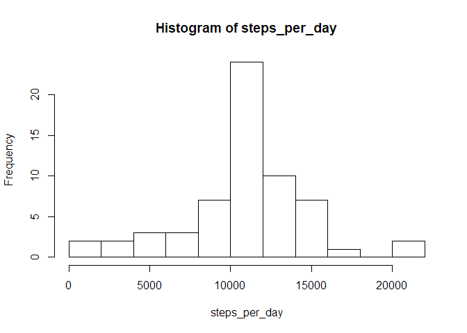

## Loading and preprocessing the data


```r
steps <- 
  read_csv("activity.zip", col_types = cols(
    steps = col_integer(),
    date = col_date(format = ""),
    interval = col_integer()
    ))
```

## What is mean total number of steps taken per day?


```r
daily <- steps %>% 
  count(date, wt = steps) %>% 
  rename(steps_per_day = n) 

summary(daily)
```

```
##       date            steps_per_day  
##  Min.   :2012-10-01   Min.   :    0  
##  1st Qu.:2012-10-16   1st Qu.: 6778  
##  Median :2012-10-31   Median :10395  
##  Mean   :2012-10-31   Mean   : 9354  
##  3rd Qu.:2012-11-15   3rd Qu.:12811  
##  Max.   :2012-11-30   Max.   :21194
```


```r
with(daily, hist(steps_per_day, breaks = 10))
```

<!-- -->

The mean is slightly less than the median, and the distribution is not symmetric. The peak in the first bin is evidence of missing values.

## What is the average daily activity pattern?


```r
intervals <- 
  steps %>% 
  group_by(interval) %>% 
  summarise(avg_steps = mean(steps, na.rm = TRUE))

intervals %>% 
  qplot(interval, avg_steps, geom = "line", data = .)
```

<!-- -->


```r
intervals %>% arrange(desc(avg_steps))
```

```
## # A tibble: 288 x 2
##    interval avg_steps
##       <int>     <dbl>
##  1      835      206.
##  2      840      196.
##  3      850      183.
##  4      845      180.
##  5      830      177.
##  6      820      171.
##  7      855      167.
##  8      815      158.
##  9      825      155.
## 10      900      143.
## # ... with 278 more rows
```

Interval 08:35 has the most steps, on average. Walking to work?

## Imputing missing values

There are 2304 missing (NA) in the steps column.

Find the median per interval:


```r
interval_means <- 
  steps %>% 
  group_by(interval) %>% 
  summarise(mean = coalesce(mean(steps, na.rm = TRUE), 0))

infilled <-
  steps %>% 
  left_join(interval_means, by = "interval") %>% 
  mutate(steps = coalesce(as.numeric(steps), mean)) %>% 
  select(-mean)

infilled_daily <-
  infilled %>% 
  count(date, wt = steps) %>% 
  rename(steps_per_day = n)

with(infilled_daily, hist(steps_per_day, breaks = 10))
```

<!-- -->


```r
summary(infilled_daily)
```

```
##       date            steps_per_day  
##  Min.   :2012-10-01   Min.   :   41  
##  1st Qu.:2012-10-16   1st Qu.: 9819  
##  Median :2012-10-31   Median :10766  
##  Mean   :2012-10-31   Mean   :10766  
##  3rd Qu.:2012-11-15   3rd Qu.:12811  
##  Max.   :2012-11-30   Max.   :21194
```

The mean and median are now equal at 10766, a consequence of imputing entire days with the interval means. The distribution now appears more symmetric, more of a bell curve, without the peak at zero steps. 

## Are there differences in activity patterns between weekdays and weekends?


```r
weekend <- c("Saturday", "Sunday")
 
infilled %>% 
  mutate(week_part = if_else(weekdays(date) %in% weekend, "weekend", "weekday")) %>% 
  group_by(week_part, interval) %>% 
  summarise(avg_steps = mean(steps)) %>% 
  qplot(x = interval, y = avg_steps, facets = week_part ~ ., geom = "line", data = .)
```

<!-- -->

Yes, the weekend is missing the peak around 8:30am (no commute?) and more activity after 10am (sedantary job during week?)
